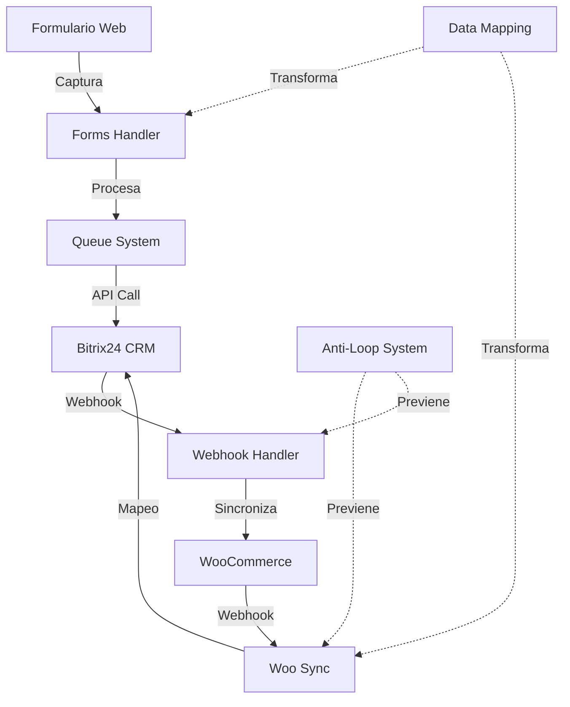

**Plugin profesional de WordPress para integración bidireccional con Bitrix24 CRM**

## 📋 Tabla de Contenidos

- [🎯 Características](#-características)
- [🛠️ Instalación](#️-instalación)
- [⚙️ Configuración](#️-configuración)
- [🚀 Uso](#-uso)
- [🏗️ Arquitectura](#️-arquitectura)
- [📡 API Reference](#-api-reference)
- [🔧 Desarrollo](#-desarrollo)
- [📊 Monitoreo](#-monitoreo)
- [🤝 Contribución](#-contribución)
- [📄 Licencia](#-licencia)

---

## 🎯 Características

### 🔄 **Sincronización Bidireccional**
- **WooCommerce ↔ Bitrix24**: Sincronización automática de pedidos, clientes y productos
- **Prevención de loops**: Sistema anti-loop avanzado para evitar sincronizaciones infinitas
- **Mapeo inteligente**: Campos automáticamente mapeados entre sistemas

### 📝 **Captura Universal de Formularios**
- **Detección automática**: Captura formularios de contacto sin configuración
- **Anti-spam**: Sistema honeypot y validación de tiempo de envío
- **Múltiples fuentes**: Contact Form 7, WPForms, Elementor, y formularios personalizados

### 🎯 **Gestión Inteligente de Leads**
- **Anti-duplicados**: Detecta leads existentes por email
- **Timeline optimizado**: Comentarios estructurados en lugar de actividades fallidas
- **Mapeo avanzado**: Transformación automática de campos de formulario

### 📡 **Webhooks & API**
- **Webhooks Bitrix24**: Recepción automática de cambios en tiempo real
- **REST API**: Endpoints para integración con sistemas externos
- **OAuth2**: Autenticación segura con Bitrix24

### 📊 **Monitoreo & Logs**
- **Dashboard completo**: Panel de control con estadísticas en tiempo real
- **Logs estructurados**: Sistema de logging categorizado con emojis
- **Diagnóstico automático**: Tests integrados para verificar funcionalidad

---

## 🛠️ Instalación

### Requisitos del Sistema

| Componente | Versión Mínima | Recomendada |
|------------|----------------|-------------|
| **WordPress** | 5.8 | 6.0+ |
| **PHP** | 7.4 | 8.0+ |
| **MySQL** | 5.6 | 8.0+ |
| **WooCommerce** | 5.0 | 7.0+ *(opcional)* |

### 📦 Instalación Automática

1. **Descargar el plugin:**
   ```bash
   wget https://github.com/yeison/yeison-btx/archive/main.zip
   ```

2. **Subir a WordPress:**
   - Ir a `Plugins > Añadir nuevo > Subir plugin`
   - Seleccionar el archivo ZIP
   - Activar el plugin

3. **Verificar instalación:**
   ```bash
   # Verificar que las tablas se crearon
   wp db query "SHOW TABLES LIKE 'wp_yeison_btx_%'"
   ```

### 🔧 Instalación Manual

```bash
# Clonar repositorio
git clone https://github.com/yeison/yeison-btx.git
cd yeison-btx

# Copiar a WordPress
cp -r . /var/www/html/wp-content/plugins/yeison-btx/

# Activar plugin
wp plugin activate yeison-btx
```

---

## ⚙️ Configuración

### 🔐 1. Configurar Aplicación en Bitrix24

1. **Ir a Bitrix24:**
   ```
   https://tu-empresa.bitrix24.com/devops/section/standard/
   ```

2. **Crear aplicación local:**
   - Nombre: `Yeison BTX WordPress`
   - URL del sitio: `https://tu-sitio.com`
   - Página inicial: `https://tu-sitio.com/wp-admin/admin.php?page=yeison-btx`

3. **Configurar permisos:**
   ```json
   {
     "crm.lead.add": "Crear leads",
     "crm.lead.list": "Listar leads", 
     "crm.contact.add": "Crear contactos",
     "crm.contact.get": "Obtener contactos",
     "crm.deal.add": "Crear deals",
     "crm.timeline.comment.add": "Comentarios timeline"
   }
   ```

### 🔧 2. Configurar Plugin WordPress

1. **Acceder al panel:**
   ```
   WordPress Admin > Yeison BTX > Configuración
   ```

2. **Configurar conexión:**
   ```
   Dominio Bitrix24: tu-empresa.bitrix24.com
   Client ID: [ID de aplicación]
   Client Secret: [Secret de aplicación]
   ```

3. **Autorizar conexión:**
   - Hacer clic en "Autorizar con Bitrix24"
   - Permitir permisos en Bitrix24
   - Verificar conexión exitosa

### 📡 3. Configurar Webhooks (Automático)

El plugin registra automáticamente estos webhooks:

| Evento | URL | Función |
|--------|-----|---------|
| `ONCRMCONTACTUPDATE` | `/wp-json/yeison-bitrix/v1/webhook/contact` | Sync contacto → cliente |
| `ONCRMDEALUPDATE` | `/wp-json/yeison-bitrix/v1/webhook/deal` | Sync deal → pedido |

---

## 🚀 Uso

### 📝 Captura de Formularios

#### Automática (Recomendada)
```html
<!-- El plugin detecta automáticamente formularios como este -->
<form method="post" class="contact-form">
    <input type="text" name="name" placeholder="Nombre" required>
    <input type="email" name="email" placeholder="Email" required>
    <textarea name="message" placeholder="Mensaje"></textarea>
    <button type="submit">Enviar</button>
</form>
```

#### Manual vía JavaScript
```javascript
// Envío manual al endpoint REST
fetch('/wp-json/yeison-btx/v1/form', {
    method: 'POST',
    headers: {
        'Content-Type': 'application/json',
        'X-WP-Nonce': wpApiSettings.nonce
    },
    body: JSON.stringify({
        form_data: {
            name: 'Juan Pérez',
            email: 'juan@example.com',
            message: 'Interesado en sus servicios'
        }
    })
});
```

### 🛒 Sincronización WooCommerce

#### Configuración Recomendada
```php
// En wp-config.php o functions.php
define('YEISON_BTX_SYNC_ORDERS', true);
define('YEISON_BTX_SYNC_CUSTOMERS', true);
define('YEISON_BTX_CREATE_DEALS', true);
```

#### Estados de Pedido Mapeados
| WooCommerce | Bitrix24 | Descripción |
|-------------|----------|-------------|
| `pending` | `NEW` | Pedido pendiente |
| `processing` | `EXECUTING` | En proceso |
| `completed` | `WON` | Completado |
| `cancelled` | `LOSE` | Cancelado |

### 🎯 Gestión de Leads

#### Email Nuevo → Lead Nuevo
```
Formulario con: juan.nuevo@example.com
→ Crea Lead en Bitrix24
→ ID: 123, Título: "Lead: Juan Nuevo"
```

#### Email Existente → Timeline Comment
```
Formulario con: juan.existente@example.com
→ Busca Lead existente (ID: 100)
→ Agrega Timeline Comment con nueva información
→ NO crea Lead duplicado
```

---

## 🏗️ Arquitectura

### 🔄 Flujo de Datos



### 🗄️ Base de Datos

#### Tabla: `wp_yeison_btx_logs`
```sql
CREATE TABLE wp_yeison_btx_logs (
    id bigint(20) NOT NULL AUTO_INCREMENT,
    type varchar(50) NOT NULL DEFAULT 'info',
    action varchar(100) NOT NULL,
    message text,
    data longtext,
    user_id bigint(20) DEFAULT NULL,
    ip_address varchar(100) DEFAULT NULL,
    created_at datetime DEFAULT CURRENT_TIMESTAMP,
    PRIMARY KEY (id),
    KEY type_index (type),
    KEY created_at_index (created_at)
);
```

#### Tabla: `wp_yeison_btx_sync`
```sql
CREATE TABLE wp_yeison_btx_sync (
    id bigint(20) NOT NULL AUTO_INCREMENT,
    entity_type varchar(50) NOT NULL,
    local_id varchar(100) NOT NULL,
    remote_id varchar(100) NOT NULL,
    sync_status varchar(20) DEFAULT 'synced',
    last_sync datetime DEFAULT CURRENT_TIMESTAMP,
    sync_data longtext,
    PRIMARY KEY (id),
    UNIQUE KEY entity_mapping (entity_type, local_id),
    KEY remote_lookup (entity_type, remote_id)
);
```

#### Tabla: `wp_yeison_btx_queue`
```sql
CREATE TABLE wp_yeison_btx_queue (
    id bigint(20) NOT NULL AUTO_INCREMENT,
    form_type varchar(50) NOT NULL,
    form_data longtext NOT NULL,
    status varchar(20) DEFAULT 'pending',
    attempts int(11) DEFAULT 0,
    processed_at datetime DEFAULT NULL,
    error_message text,
    created_at datetime DEFAULT CURRENT_TIMESTAMP,
    PRIMARY KEY (id),
    KEY status_index (status)
);
```

---

## 📡 API Reference

### 🛠️ Endpoints REST

#### **POST** `/wp-json/yeison-btx/v1/form`
Procesar formulario web

**Headers:**
```http
Content-Type: application/json
X-WP-Nonce: {nonce}
```

**Body:**
```json
{
    "form_data": {
        "name": "Juan Pérez",
        "email": "juan@example.com",
        "phone": "+506 8888-9999",
        "message": "Mensaje del formulario",
        "_meta": {
            "origin": "https://example.com/contacto"
        }
    }
}
```

**Response:**
```json
{
    "success": true,
    "message": "Formulario procesado exitosamente",
    "data": {
        "queue_id": 123,
        "form_type": "contact",
        "action": "new_lead_created",
        "lead_id": 456
    }
}
```

#### **GET** `/wp-json/yeison-btx/v1/status`
Estado del sistema

**Response:**
```json
{
    "enabled": true,
    "auto_process": true,
    "pending_queue": 2,
    "processed_today": 15,
    "endpoints": {
        "rest_api": "/wp-json/yeison-btx/v1/form",
        "ajax": "/wp-admin/admin-ajax.php?action=yeison_btx_form"
    }
}
```

### 🔗 Webhooks Bitrix24

#### **POST** `/wp-json/yeison-bitrix/v1/webhook/contact`
Recibir actualización de contacto

#### **POST** `/wp-json/yeison-bitrix/v1/webhook/deal`
Recibir actualización de deal

### 🎛️ Funciones PHP

#### Logging
```php
// Registrar evento en logs
yeison_btx_log('Mensaje del evento', 'success', array(
    'lead_id' => 123,
    'action' => 'timeline_created'
));
```

#### Configuración
```php
// Obtener configuración
$domain = yeison_btx_get_option('bitrix_domain');

// Actualizar configuración  
yeison_btx_update_option('auto_process', true);
```

#### API Bitrix24
```php
// Obtener instancia API
$api = yeison_btx_api();

// Crear lead
$lead_id = $api->create_lead(array(
    'TITLE' => 'Lead desde WordPress',
    'NAME' => 'Juan',
    'EMAIL' => array(array('VALUE' => 'juan@example.com'))
));
```

---

## 🔧 Desarrollo

### 🛠️ Configuración de Desarrollo

```bash
# Clonar repositorio
git clone https://github.com/yeison/yeison-btx.git
cd yeison-btx

# Instalar dependencias (si las hay)
composer install

# Configurar entorno de desarrollo
cp .env.example .env
```

### 🧪 Testing

#### Tests Unitarios
```bash
# Ejecutar tests
./vendor/bin/phpunit tests/

# Test específico
./vendor/bin/phpunit tests/BitrixApiTest.php
```

#### Tests de Integración
```bash
# Test completo del sistema
wp eval "yeison_btx_test_timeline_connectivity();"

# Test de formularios
curl -X POST https://test.local/wp-json/yeison-btx/v1/form \
  -H "Content-Type: application/json" \
  -d '{"form_data":{"name":"Test","email":"test@example.com"}}'
```

### 📝 Debugging

#### Habilitar Debug
```php
// En wp-config.php
define('WP_DEBUG', true);
define('WP_DEBUG_LOG', true);
define('YEISON_BTX_DEBUG', true);
```

#### Logs en Tiempo Real
```bash
# Seguir logs de WordPress
tail -f /var/log/wordpress/debug.log | grep "Yeison BTX"

# Logs específicos del plugin
wp eval "
\$logs = \$wpdb->get_results('SELECT * FROM wp_yeison_btx_logs ORDER BY created_at DESC LIMIT 10');
foreach(\$logs as \$log) {
    echo \$log->created_at . ' [' . \$log->type . '] ' . \$log->message . \"\n\";
}
"
```

### 🚀 Deployment

#### Producción
```bash
# Crear release
git tag v1.0.0
git push origin v1.0.0

# Generar ZIP para distribución
zip -r yeison-btx-v1.0.0.zip . \
  -x "*.git*" "tests/*" "*.md" ".env*"
```

---

## 📊 Monitoreo

### 📈 Dashboard de Admin

Acceder a: `WordPress Admin > Yeison BTX`

**Métricas disponibles:**
- ✅ Estado del sistema y salud general
- 📊 Estadísticas de formularios procesados
- 🔄 Cola de procesamiento en tiempo real
- 📝 Logs categorizados por tipo
- 🧪 Tests integrados de conectividad

### 🔍 URLs de Testing

| Test | URL | Descripción |
|------|-----|-------------|
| **Conectividad Timeline** | `/wp-admin/admin-ajax.php?action=yeison_btx_test_timeline` | Probar Timeline Comments |
| **Estado General** | `/wp-json/yeison-btx/v1/status` | API status endpoint |
| **Limpiar Cola** | `/wp-admin/admin-ajax.php?action=yeison_btx_clear_queue_improved` | Limpiar elementos pendientes |
| **Debug Cola** | `/wp-admin/admin-ajax.php?action=yeison_btx_debug_queue` | Inspeccionar cola |

### 📋 Comandos WP-CLI

```bash
# Estadísticas del sistema
wp eval "print_r(yeison_btx_get_stats());"

# Procesar cola manualmente
wp eval "yeison_btx_forms()->process_queue();"

# Test de conectividad
wp eval "print_r(yeison_btx_test_timeline_connectivity());"

# Limpiar logs antiguos
wp db query "DELETE FROM wp_yeison_btx_logs WHERE created_at < DATE_SUB(NOW(), INTERVAL 30 DAY);"
```

---

## 🤝 Contribución

### 📋 Guías de Contribución

1. **Fork** el repositorio
2. **Crear** branch para feature: `git checkout -b feature/nueva-funcionalidad`
3. **Commit** cambios: `git commit -am 'Agrega nueva funcionalidad'`
4. **Push** al branch: `git push origin feature/nueva-funcionalidad`
5. **Crear** Pull Request

### 🎯 Estándares de Código

```php
// ✅ BIEN: Código documentado y estructurado
/**
 * Crear Timeline Comment en Bitrix24
 * 
 * @param int $lead_id ID del lead
 * @param array $form_data Datos del formulario
 * @return int|false ID del comentario o false en error
 */
private function create_timeline_comment($lead_id, $form_data) {
    // Implementación...
}

// ✅ BIEN: Logging estructurado
yeison_btx_log('Timeline creado exitosamente', 'success', array(
    'lead_id' => $lead_id,
    'comment_id' => $comment_id
));
```

### 🐛 Reportar Bugs

**Template de Issue:**
```markdown
## 🐛 Bug Report

### Descripción
Descripción clara del problema

### Pasos para Reproducir
1. Ir a...
2. Hacer clic en...
3. Ver error...

### Comportamiento Esperado
Lo que debería pasar

### Logs
```
[Pegar logs relevantes aquí]
```

### Entorno
- WordPress: 6.0
- PHP: 8.0
- Plugin Version: 1.0.0
```

---

## 📄 Licencia

Este proyecto está licenciado bajo la **GPL-2.0 License** - ver el archivo [LICENSE](LICENSE) para detalles.

### 📞 Soporte

- **📧 Email:** yeison.a@team.guruxglobal.com
- **🌐 Website:** https://yeison.guruxdev.com
- **📚 Documentación:** https://github.com/yeison/yeison-btx/wiki
- **🐛 Issues:** https://github.com/yeison/yeison-btx/issues

---

### 🎯 Desarrollado por

**Yeison Araya** - *Full Stack Developer*
- 🌐 [Website](https://yeison.guruxdev.com)
- 📧 [Email](mailto:yeison.a@team.guruxglobal.com)
- 💼 [LinkedIn](https://linkedin.com/in/yeison-araya)

---
